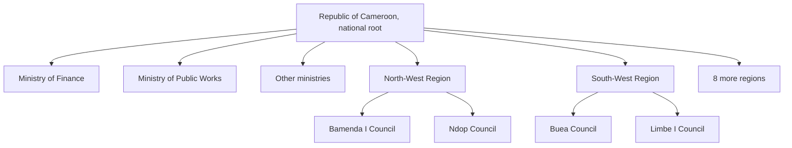
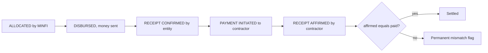

# BuildRight Governance and Finance Architecture

Status: proposal for review. Nothing in this document is built yet.
Scope: the changes requested on 2026-08-24, namely the Cameroonian administrative
hierarchy (ministries, regions, councils), projects owned at every level, budget
allocation and payment tracking from the Ministry of Finance down to the contractor's
confirmation of receipt, verified contractor accounts, tamper-evident financial records,
and two-step confirmation on every financial action. The design also prepares the API
for the planned mobile application.

## 1. Design rules carried forward

The platform already has working principles. Every part of this plan obeys them.

1. Derived truth beats self-reported truth. A mismatch between "paid" and "confirmed
   received" is computed, never declared.
2. A record states a fact with its figures, never an accusation.
3. Every rule lives in a service, enforced for every caller. Frontend checks are cosmetic.
4. Every user-facing string ships in English and French together. The parity test fails otherwise.
5. Open data is additive only. Existing public API fields never change meaning.
6. Low bandwidth first. New pages follow the existing image and payload discipline.

## 2. The administrative hierarchy

### 2.1 Shape

Cameroon's structure, as requested: councils sit under their regions, ministries are
national bodies. One national root ties the tree together so that country-wide works
(a dam serving the whole country) have a location entity like everything else.



### 2.2 One table, not three

A single `gov_entities` table holds every level:

```sql
CREATE TABLE gov_entities (
    id          CHAR(36) PRIMARY KEY,
    type        ENUM('NATIONAL','MINISTRY','REGION','COUNCIL') NOT NULL,
    code        VARCHAR(30) UNIQUE NOT NULL,   -- 'MINFI', 'NW', 'NW-BAMENDA-1'
    name_en     VARCHAR(255) NOT NULL,
    name_fr     VARCHAR(255) NOT NULL,
    parent_id   CHAR(36) NULL,                  -- COUNCIL to REGION, others to NATIONAL
    created_at  TIMESTAMP DEFAULT CURRENT_TIMESTAMP,
    FOREIGN KEY (parent_id) REFERENCES gov_entities(id),
    INDEX idx_entities_parent (parent_id),
    INDEX idx_entities_type (type)
);
```

Why one table instead of `regions`, `councils` and `ministries` separately: the finance
ledger, the budget rows and the account system all need one foreign-key target, because
an allocation can go to a ministry or a council, and the request says every entity on
the platform receives a private number. Three tables would force polymorphic references
the database cannot enforce. One typed table keeps every foreign key real.

Hierarchy depth is fixed at two (national root, then ministry or region, then council),
so no recursive queries are ever needed.

### 2.3 Seed data and its verification

- 10 regions: complete and certain.
- Ministries: the infrastructure-relevant set seeded first (MINFI, MINTP, MINEE,
  MINSANTE, MINEDUB, MINESEC, MINHDU, MINT, MINADER, MINDDEVEL, MINEPAT), extensible.
- Councils: Cameroon has about 360 communes plus 14 city councils. The seed ships the
  full known list in `Database/data/councils.csv` (code, region, name_en, name_fr) with
  an import script, and the list must be checked against the official MINDDEVEL gazette
  before production. Names in a public state record must be exactly right, so the plan
  treats the council list as data to verify, not knowledge to assume.

Bilingual names are first-class columns because entity names appear on every public page.

## 3. Projects in the hierarchy

### 3.1 Ownership and area are different questions

- Who runs it: `projects.owner_entity_id`, a council or a ministry.
- Where it happens: a `project_areas` join table, because a ministerial road can cross
  the North-West, the South-West and the Littoral, and a dam can serve the whole country.

```sql
ALTER TABLE projects ADD COLUMN owner_entity_id CHAR(36) NULL,
    ADD FOREIGN KEY (owner_entity_id) REFERENCES gov_entities(id);

CREATE TABLE project_areas (
    project_id CHAR(36) NOT NULL,
    entity_id  CHAR(36) NOT NULL,   -- a council, a region, or the national root
    PRIMARY KEY (project_id, entity_id),
    FOREIGN KEY (project_id) REFERENCES projects(id) ON DELETE CASCADE,
    FOREIGN KEY (entity_id) REFERENCES gov_entities(id)
);
```

Rules enforced in the project service:

| Owner | Allowed areas |
|---|---|
| Council | exactly its own council (region implied by the parent link) |
| Ministry | one region, several regions, or the national root |

### 3.2 Migration of existing projects

The current free-text `region` column stays readable during the transition. A backfill
maps each existing project's region string to its region entity and gives it a
provisional ministry owner (MINTP by default, correctable by an admin). The old column
stops accepting writes one release later. The public API keeps emitting `region` for
compatibility and adds `ownerEntity` and `areas` alongside it.

## 4. Accounts, roles and contractor verification

### 4.1 Roles

| Role | Scope | Powers |
|---|---|---|
| PLATFORM_ADMIN | whole platform | today's ADMIN, renamed; operations and moderation |
| ENTITY_ADMIN | one entity via `users.entity_id` | manage that entity's projects and finances |
| CONTRACTOR | own account | update assigned projects, confirm payments received |
| DEVELOPER_ADMIN | unchanged | access codes, team page |
| PUBLIC | none | read everything |

Special powers derive from the entity, not from extra roles: an ENTITY_ADMIN whose
entity is MINFI can create allocations and record disbursements; one whose entity is
MINTP can verify contractors. The service checks `entity.code`, so there is exactly one
admin role to reason about.

Access codes gain an `entity_id`, so a code mints an administrator bound to one specific
council or ministry. The code still carries the role and still burns on use.

### 4.2 Contractor verification by MINTP

```sql
CREATE TABLE contractor_profiles (
    user_id         CHAR(36) PRIMARY KEY,
    company_name    VARCHAR(255) NOT NULL,
    rccm_number     VARCHAR(100),              -- trade register
    taxpayer_number VARCHAR(100),              -- NIU
    status          ENUM('PENDING','VERIFIED','REJECTED') DEFAULT 'PENDING',
    verified_by     CHAR(36) NULL,             -- MINTP admin user
    verified_at     TIMESTAMP NULL,
    rejection_reason TEXT NULL,
    FOREIGN KEY (user_id) REFERENCES users(id)
);

CREATE TABLE contractor_documents (
    id CHAR(36) PRIMARY KEY,
    user_id CHAR(36) NOT NULL,
    label VARCHAR(255) NOT NULL,
    file_url TEXT NOT NULL,                    -- existing Cloudinary pipeline
    uploaded_at TIMESTAMP DEFAULT CURRENT_TIMESTAMP,
    FOREIGN KEY (user_id) REFERENCES users(id)
);
```

Rules: only a VERIFIED contractor can be assigned a project or receive a payment.
Existing seeded contractors become PENDING and are flagged until verified, visibly.
Verification and rejection are ledger events (section 6), so approval history is permanent.

## 5. The finance model

Fiscal year: the calendar year, as in Cameroonian public finance.

### 5.1 The five money records

| Table | What it records | Who writes it |
|---|---|---|
| `budgets` | an entity's planned budget for a fiscal year | the entity's admin |
| `allocations` | MINFI commits an amount to an entity for a year and purpose | MINFI admin |
| `disbursements` | money actually sent against an allocation, partials allowed | sent by MINFI, receipt confirmed by the recipient entity |
| `entity_income` | income an entity declares (local taxes, fees) | the entity's admin |
| `project_payments` | an owner entity pays a contractor for a project, receipt confirmed by the contractor, partials allowed | initiated by the entity admin, confirmed by the contractor |

### 5.2 State flow



Every arrow is a separate action by a separate account, each requiring two-step
confirmation (section 7), each writing a ledger entry (section 6). Nobody confirms
their own payment. The gap between any two adjacent amounts is computed and published:

- MINFI says disbursed 500M, entity confirms receiving 450M: a 50M gap, flagged.
- Entity says paid 100M, contractor affirms 70M: a 30M gap, flagged critical.

That computed gap is the entire accountability value of this feature, which is why
confirmation is modelled as a first-class record with its own actor and timestamp,
never as a status field someone toggles.

### 5.3 Key columns

```sql
CREATE TABLE allocations (
    id CHAR(36) PRIMARY KEY,
    from_entity_id CHAR(36) NOT NULL,          -- MINFI
    to_entity_id   CHAR(36) NOT NULL,
    fiscal_year    SMALLINT NOT NULL,
    amount_xaf     DECIMAL(18,2) NOT NULL,
    purpose        VARCHAR(500) NOT NULL,
    created_by     CHAR(36) NOT NULL,
    created_at     TIMESTAMP DEFAULT CURRENT_TIMESTAMP,
    FOREIGN KEY (from_entity_id) REFERENCES gov_entities(id),
    FOREIGN KEY (to_entity_id)   REFERENCES gov_entities(id),
    INDEX idx_alloc_to (to_entity_id, fiscal_year)
);

CREATE TABLE disbursements (
    id CHAR(36) PRIMARY KEY,
    allocation_id CHAR(36) NOT NULL,
    amount_xaf    DECIMAL(18,2) NOT NULL,
    sent_by       CHAR(36) NOT NULL,
    sent_at       TIMESTAMP DEFAULT CURRENT_TIMESTAMP,
    amount_confirmed_xaf DECIMAL(18,2) NULL,   -- what the recipient says arrived
    confirmed_by  CHAR(36) NULL,
    confirmed_at  TIMESTAMP NULL,
    FOREIGN KEY (allocation_id) REFERENCES allocations(id)
);

CREATE TABLE project_payments (
    id CHAR(36) PRIMARY KEY,
    project_id     CHAR(36) NOT NULL,
    payer_entity_id CHAR(36) NOT NULL,
    contractor_id  CHAR(36) NOT NULL,
    amount_xaf     DECIMAL(18,2) NOT NULL,
    note           VARCHAR(500),
    initiated_by   CHAR(36) NOT NULL,
    initiated_at   TIMESTAMP DEFAULT CURRENT_TIMESTAMP,
    amount_affirmed_xaf DECIMAL(18,2) NULL,    -- what the contractor says arrived
    affirmed_at    TIMESTAMP NULL,
    FOREIGN KEY (project_id) REFERENCES projects(id),
    FOREIGN KEY (payer_entity_id) REFERENCES gov_entities(id),
    FOREIGN KEY (contractor_id) REFERENCES users(id),
    INDEX idx_payments_contractor (contractor_id),
    INDEX idx_payments_project (project_id)
);
```

`entity_income` and `budgets` follow the same pattern (entity, fiscal_year, amount,
label, recorded_by). Confirmed payment totals feed the existing `projects.spent`
figure, which stops being free-typed and starts being derived from confirmed payments,
closing today's largest self-reporting hole.

## 6. The integrity layer: a hash-chained ledger

### 6.1 What "signed and encrypted so they cannot be reversed" becomes

Two honest corrections to the wording, because they matter for a public record:

1. Public financial records must not be encrypted at rest, or citizens cannot read them
   and the platform stops being a transparency record. Encryption belongs to secrets
   (passwords and private numbers are hashed, transport runs over TLS).
2. Software alone cannot make deletion physically impossible. What it can make is any
   alteration detectable by anyone, which is what audit needs. That is tamper evidence,
   achieved with an append-only, hash-chained, signed ledger.

### 6.2 The ledger

Every financial action writes a row in the same database transaction as the record it
describes, exactly the pattern already proven by `project_changes`:

```sql
CREATE TABLE ledger_entries (
    seq            BIGINT AUTO_INCREMENT PRIMARY KEY,
    occurred_at    TIMESTAMP(3) NOT NULL DEFAULT CURRENT_TIMESTAMP(3),
    entry_type     VARCHAR(50) NOT NULL,   -- allocation.created, payment.affirmed, contractor.verified, ...
    ref_table      VARCHAR(50) NOT NULL,
    ref_id         CHAR(36) NOT NULL,
    actor_user_id  CHAR(36) NOT NULL,
    actor_entity_id CHAR(36) NULL,
    amount_xaf     DECIMAL(18,2) NULL,
    details_json   TEXT NOT NULL,          -- canonical JSON of the action
    prev_hash      CHAR(64) NOT NULL,
    entry_hash     CHAR(64) NOT NULL,      -- sha256(seq, prev_hash, occurred_at, details_json)
    signature      CHAR(64) NOT NULL       -- HMAC-SHA256(entry_hash, LEDGER_HMAC_KEY)
);
```

Protection stack, each layer covering the one below it:

| Layer | Defeats |
|---|---|
| UPDATE and DELETE rejected by database triggers (the migration 004 pattern) | any application bug, any casual database client |
| Hash chain: each entry hashes its predecessor | an attacker with trigger-dropping rights, because editing entry N breaks every hash after it |
| HMAC signature with a key held outside the database | an attacker with full database access, who can rewrite the chain but cannot produce valid signatures |
| Public verification | silent replacement of the whole ledger, because published head hashes stop matching |

Public verification is the piece that makes this a transparency feature rather than an
internal control: `GET /api/v1/public/ledger/head` returns the latest sequence number
and hash, the CSV export embeds it, and a documented procedure lets any journalist
recompute the chain from the public data. The record audits itself in public.

### 6.3 What the ledger does not do

It proves the record was not altered after the fact. It cannot prove the entered figures
were true. Wrong figures stay wrong, but they stay wrong with a name, a timestamp and a
signature attached, permanently.

## 7. Two-step confirmation of financial actions

Every entity administrator and every contractor is issued a Private Confirmation Number
at account creation:

- generated server-side with `crypto.randomInt` over the existing unambiguous alphabet,
  12 characters, shown exactly once, stored only as a bcrypt hash, like a password
- any financial action (allocate, disburse, confirm receipt, initiate payment, affirm
  payment, record income) requires the current session plus a fresh entry of both the
  account password and the PCN in the confirming request
- verification failures on the confirm endpoints are limited to 5 per 15 minutes per
  account, stricter than the login limiter
- the resulting ledger entry records that both factors were verified

A stolen session or a stolen password alone can never move a record of money. Lost PCNs
are reissued by a PLATFORM_ADMIN, and the reissue is itself a ledger event. The mobile
app later adds device-bound keys on top; nothing in this design blocks that.

## 8. Automatic finance flags

The existing flag engine extends from projects to money, same rules: computed, stated
with figures, one flag per problem.

| Flag | Severity | Fires when |
|---|---|---|
| payment_mismatch | critical | contractor affirmed less than the entity paid |
| payment_unconfirmed | warning | 14 days after initiation with no contractor affirmation |
| receipt_mismatch | critical | entity confirmed less than MINFI disbursed |
| receipt_unconfirmed | warning | 14 days after disbursement with no entity confirmation |
| contractor_unverified | critical | project assigned or payment made to a non-verified contractor |
| spend_over_funding | warning | a project's confirmed payments exceed its owner's confirmed receipts for the year |

## 9. API surface

All new endpoints follow the existing conventions: rules in services, camelCase out
through the serializer, AppError for failures, bilingual strings client-side.

| Area | Endpoints |
|---|---|
| Hierarchy | GET /entities (tree), GET /entities/:id (profile with projects and finance summary) |
| Finance, MINFI | POST /finance/allocations, POST /finance/allocations/:id/disbursements |
| Finance, entity | POST /finance/disbursements/:id/confirm, POST /finance/income, GET /finance/mine |
| Payments | POST /projects/:id/payments, POST /payments/:id/affirm |
| Contractors | POST /contractor/profile, POST /contractor/documents, GET /contractor/queue (MINTP), POST /contractor/:id/verify |
| Open data | GET /public/entities, GET /public/finance.csv, GET /public/ledger/head |

Every money-mutating endpoint takes `{ password, pcn }` alongside its payload.

Mobile readiness: `POST /auth/token` returns the same JWT as a bearer token in the body
for the future app, since `protect` already accepts the Authorization header. Cookies
remain the web path. Nothing else needs to change for mobile.

## 10. Frontend surfaces

| Surface | Audience | Content |
|---|---|---|
| Governance browser | public | regions with their councils, ministries, each entity's page: budget, allocations with confirmation status, income, projects, payments and their affirmation gaps |
| National money view | public | totals flowing from MINFI down, with every unconfirmed or mismatched amount surfaced |
| MINFI desk | MINFI admin | create allocations, record disbursements, watch confirmations |
| Entity desk | council and ministry admins | confirm receipts, manage projects, pay contractors, record income |
| Contractor account | contractors | payment inbox with affirm actions, verification status, documents |
| Verification queue | MINTP admin | pending contractor profiles with their documents |

Presentation rules, per the standing instruction: no em dashes anywhere in copy, no
emoji, no decorative borders. Icons come from a local SVG sprite (finishing the planned
replacement of the FontAwesome CDN), stroke icons drawing their colour from the existing
theme tokens. All new strings land in en.js and fr.js together.

## 11. What does not change

The design system and tokens, the project audit log, citizen reports, the i18n
mechanism, the image delivery pipeline, and the meaning of every existing open-data
field. The finance work adds tables and endpoints; it does not rewrite working systems.

## 12. Rollout phases

Each phase is independently shippable, tested, and bilingual before the next starts.

| Phase | Contents | Migrations |
|---|---|---|
| G1 Hierarchy | gov_entities, seed, project ownership and areas, backfill, public governance browser | 005, 006 |
| G2 Accounts | role rename and entity scoping, entity access codes, PCN issuance, contractor profiles and the MINTP queue | 007, 008 |
| G3 Finance core | budgets, allocations, disbursements, income, the ledger with chain and triggers, the 2FA confirm flow | 009, 010 |
| G4 Payments | project payments, contractor affirmation, spent becomes derived, finance flags | 011 |
| G5 Public money | entity finance pages, national money view, open-data finance CSV, ledger head endpoint, mobile token endpoint | none |

## 13. Risks and open items

1. Council list accuracy: shipped as verifiable data, checked against the official
   gazette before production. The highest reputational risk in this plan.
2. The ledger guarantees integrity of the record, not truth of the input.
3. PCN plus password is two knowledge factors; a fully phished user can still be
   imitated. Acceptable now; device binding arrives with the mobile app.
4. Existing projects need an owner backfill; the API runs dual-mode for one release.
5. MINFI is modelled as the single allocator, matching the request. If regions later
   allocate downward themselves, the allocations table already supports any entity pair.
