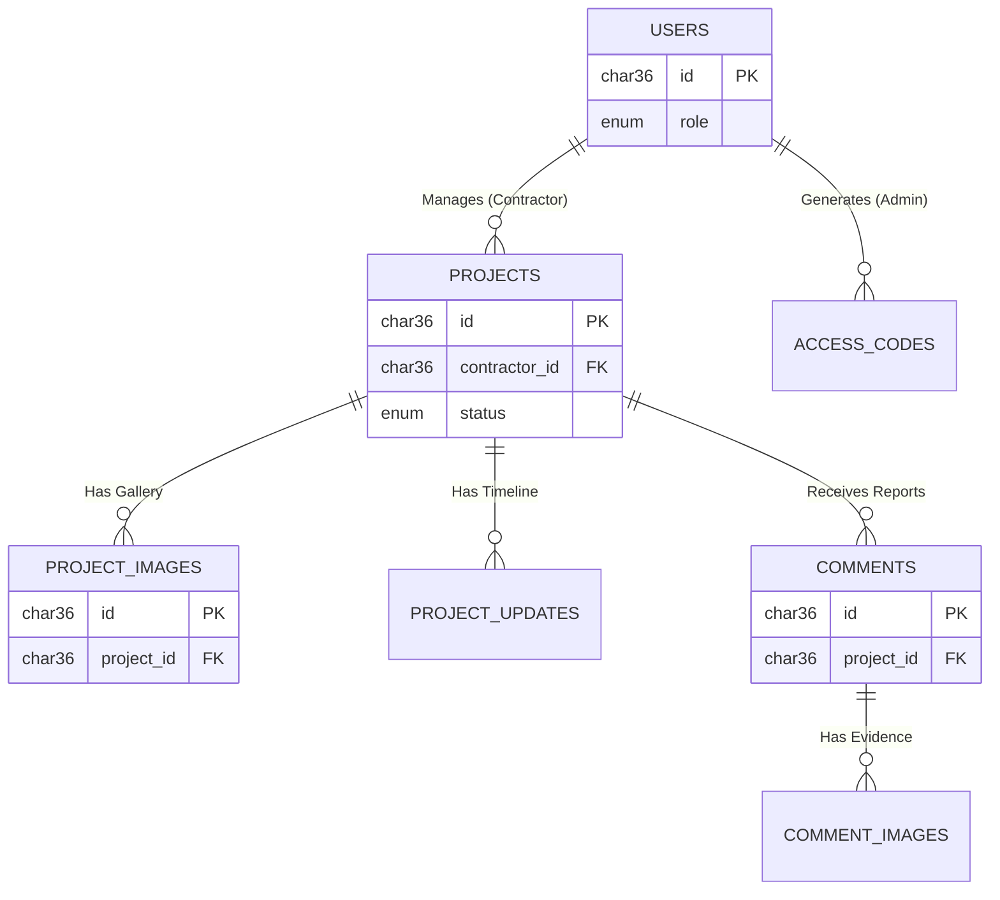

# Database Documentation: Public Infrastructure Monitor BUILDRIGHT
**Version:** 1.0
**Engine:** MySQL 8.0+ (InnoDB)
**Character Set:** `utf8mb4` (Supports international characters and emojis)

## 1. Executive Summary
This database serves as the backbone for the Public Infrastructure Monitoring platform. It manages the lifecycle of infrastructure projects (Planned -> Completed), handles role-based authentication (Admin, Contractor, Public), and facilitates citizen engagement through reports and evidence upload.

### Key Features
*   **UUID Strategy:** Uses `CHAR(36)` for all Primary Keys to ensure unique ID generation across distributed systems.
*   **Financial Precision:** Uses `DECIMAL` types to ensure zero-error currency calculations.
*   **Referential Integrity:** Enforces relationships with Cascading Deletes to keep data clean.
*   **Data Validation:** Uses `ENUM` and `CHECK` constraints to prevent invalid status or progress entries.

---

## 2. Entity Relationship Diagram (ERD)
The following diagram illustrates the logical relationships between system entities.



---

## 3. Data Dictionary
Detailed specification of every table and column in the schema.

### 3.1 Table: `users`
**Description:** Stores all registered users including Administrators, Contractors, and general Developers.

| Column | Type | Attributes | Description |
| :--- | :--- | :--- | :--- |
| **id** | `CHAR(36)` | **PK**, Not Null | Unique UUID. Defaults to `UUID()`. |
| **email** | `VARCHAR(255)` | **Unique**, Not Null | User login email. |
| **password_hash** | `VARCHAR(255)` | Not Null | Bcrypt/Argon2 encrypted password string. |
| **name** | `VARCHAR(255)` | Not Null | Full display name. |
| **role** | `ENUM` | Not Null | Authorization level (See Section 4). Default: `PUBLIC`. |
| **created_at** | `TIMESTAMP` | Default `NOW()` | Account creation time. |
| **updated_at** | `TIMESTAMP` | Auto Update | Last modification time. |

### 3.2 Table: `access_codes`
**Description:** A system for Admins to generate invitation codes that assign specific roles to new users.

| Column | Type | Attributes | Description |
| :--- | :--- | :--- | :--- |
| **code** | `VARCHAR(50)` | **PK**, Not Null | The invite code string (e.g., "DEV-2024-X"). |
| **role** | `ENUM` | Not Null | The role assigned when this code is used. |
| **is_used** | `BOOLEAN` | Default `0` | Flag: 0 = Valid, 1 = Already claimed. |
| **generated_by_user_id**| `CHAR(36)` | **FK** | ID of the Admin who created the code. |
| **created_at** | `TIMESTAMP` | Default `NOW()` | |

### 3.3 Table: `projects`
**Description:** The core entity representing a physical infrastructure project (e.g., "Central Hospital Renovation").

| Column | Type | Attributes | Description |
| :--- | :--- | :--- | :--- |
| **id** | `CHAR(36)` | **PK**, Not Null | Unique Project UUID. |
| **title** | `VARCHAR(255)` | Not Null | Official project title. |
| **description** | `TEXT` | Not Null | Detailed scope of work. |
| **location** | `VARCHAR(255)` | Not Null | Physical address or coordinates. |
| **region** | `VARCHAR(100)` | Not Null | Administrative region/state. |
| **budget** | `DECIMAL(15,2)` | Default `0.00` | Total allocated funds. |
| **spent** | `DECIMAL(15,2)` | Default `0.00` | Total funds utilized. |
| **progress** | `INT` | Check `0-100` | Percentage completion. |
| **status** | `ENUM` | Default `Planned`| Lifecycle state (See Section 4). |
| **contractor_id** | `CHAR(36)` | **FK** | Link to `users` table (the contractor). |
| **start_date** | `DATE` | Nullable | Project kick-off. |
| **completion_date** | `DATE` | Nullable | Expected or actual finish. |

### 3.4 Table: `project_images`
**Description:** Gallery images associated with a project.

| Column | Type | Attributes | Description |
| :--- | :--- | :--- | :--- |
| **id** | `CHAR(36)` | **PK**, Not Null | Unique Image UUID. |
| **project_id** | `CHAR(36)` | **FK**, Not Null | Parent Project. **Cascades on Delete.** |
| **image_url** | `TEXT` | Not Null | URL to cloud storage (S3/Firebase/Cloudinary). |
| **is_main_cover** | `BOOLEAN` | Default `0` | If 1, this image is used as the project thumbnail. |
| **uploaded_at** | `TIMESTAMP` | Default `NOW()` | Upload timestamp. |

### 3.5 Table: `project_updates`
**Description:** A timeline log of significant events (milestones) for a project.

| Column | Type | Attributes | Description |
| :--- | :--- | :--- | :--- |
| **id** | `CHAR(36)` | **PK**, Not Null | Unique Update UUID. |
| **project_id** | `CHAR(36)` | **FK**, Not Null | Parent Project. **Cascades on Delete.** |
| **message** | `TEXT` | Not Null | The content of the update. |
| **author_name** | `VARCHAR(255)` | Not Null | Name of the person posting (Snapshot). |
| **update_date** | `DATE` | Default `NOW()` | Date the event occurred. |

### 3.6 Table: `comments`
**Description:** Public or NGO feedback/reporting regarding a specific project.

| Column | Type | Attributes | Description |
| :--- | :--- | :--- | :--- |
| **id** | `CHAR(36)` | **PK**, Not Null | Unique Comment UUID. |
| **project_id** | `CHAR(36)` | **FK**, Not Null | The project being reported on. |
| **author_name** | `VARCHAR(255)` | Not Null | Name of the reporter (can be alias). |
| **author_type** | `ENUM` | Default `Citizen`| Citizen or NGO. |
| **text** | `TEXT` | Not Null | The body of the report/comment. |
| **created_at** | `TIMESTAMP` | Default `NOW()` | Submission timestamp. |

### 3.7 Table: `comment_images`
**Description:** Evidence photos attached to citizen comments.

| Column | Type | Attributes | Description |
| :--- | :--- | :--- | :--- |
| **id** | `CHAR(36)` | **PK**, Not Null | Unique Image UUID. |
| **comment_id** | `CHAR(36)` | **FK**, Not Null | Parent Comment. **Cascades on Delete.** |
| **image_url** | `TEXT` | Not Null | URL to cloud storage. |

### 3.8 Table: `team_members`
**Description:** Static content for the "Developers/About" page.

| Column | Type | Attributes | Description |
| :--- | :--- | :--- | :--- |
| **id** | `CHAR(36)` | **PK**, Not Null | Unique Member UUID. |
| **name** | `VARCHAR(255)` | Not Null | Name of team member. |
| **role** | `VARCHAR(100)` | Not Null | Job Title / Position. |
| **bio** | `TEXT` | Nullable | Biography. |
| **image_url** | `TEXT` | Nullable | Profile picture URL. |

---

## 4. Enumerations (Static Types)
These values are hardcoded into the database schema to ensure data integrity.

### A. User Roles (`users.role`, `access_codes.role`)
1.  **`ADMIN`**: Full system access. Can generate access codes and delete projects.
2.  **`CONTRACTOR`**: Can update details and status of projects assigned to them.
3.  **`DEVELOPER_ADMIN`**: Technical maintenance role.
4.  **`PUBLIC`**: Read-only access (Default).

### B. Project Status (`projects.status`)
1.  **`Planned`**: Project approved but not started.
2.  **`Ongoing`**: Construction is active.
3.  **`Stalled`**: Construction stopped due to issues.
4.  **`Completed`**: Project finished and delivered.

### C. Author Type (`comments.author_type`)
1.  **`Citizen`**: General public member.
2.  **`NGO`**: Non-Governmental Organization representative.

---

## 5. Security & Integrity Rules

1.  **Cascading Deletes:**
    *   If a `Project` is deleted, all its `Images`, `Updates`, and `Comments` are automatically deleted.
    *   If a `Comment` is deleted, all its `Comment Images` are automatically deleted.
    *   *Note:* Users are **not** deleted if they are assigned to a project. The application logic must handle reassignment before user deletion.

2.  **Constraint Checks:**
    *   **Progress:** The database will reject any insert/update where `progress` is less than 0 or greater than 100.

3.  **Default Values:**
    *   IDs are auto-generated.
    *   Timestamps default to the current server time.

---

## 6. Installation Script (MySQL)
Run this script in MySQL Workbench or via CLI to initialize the database.

```sql
-- Disable foreign key checks temporarily to allow table creation in any order
SET foreign_key_checks = 0;

-- 1. USERS
CREATE TABLE users (
    id CHAR(36) PRIMARY KEY DEFAULT (UUID()),
    email VARCHAR(255) UNIQUE NOT NULL,
    password_hash VARCHAR(255) NOT NULL,
    name VARCHAR(255) NOT NULL,
    role ENUM('ADMIN', 'CONTRACTOR', 'DEVELOPER_ADMIN', 'PUBLIC') NOT NULL DEFAULT 'PUBLIC',
    created_at TIMESTAMP DEFAULT CURRENT_TIMESTAMP,
    updated_at TIMESTAMP DEFAULT CURRENT_TIMESTAMP ON UPDATE CURRENT_TIMESTAMP
);

-- 2. ACCESS CODES
CREATE TABLE access_codes (
    code VARCHAR(50) PRIMARY KEY,
    role ENUM('ADMIN', 'CONTRACTOR', 'DEVELOPER_ADMIN', 'PUBLIC') NOT NULL,
    is_used BOOLEAN DEFAULT FALSE,
    generated_by_user_id CHAR(36),
    created_at TIMESTAMP DEFAULT CURRENT_TIMESTAMP,
    FOREIGN KEY (generated_by_user_id) REFERENCES users(id)
);

-- 3. PROJECTS
CREATE TABLE projects (
    id CHAR(36) PRIMARY KEY DEFAULT (UUID()),
    title VARCHAR(255) NOT NULL,
    description TEXT NOT NULL,
    location VARCHAR(255) NOT NULL,
    region VARCHAR(100) NOT NULL,
    budget DECIMAL(15, 2) DEFAULT 0.00,
    spent DECIMAL(15, 2) DEFAULT 0.00,
    progress INTEGER DEFAULT 0,
    CONSTRAINT chk_progress CHECK (progress >= 0 AND progress <= 100),
    status ENUM('Planned', 'Ongoing', 'Stalled', 'Completed') DEFAULT 'Planned',
    contractor_id CHAR(36),
    start_date DATE,
    completion_date DATE,
    created_at TIMESTAMP DEFAULT CURRENT_TIMESTAMP,
    updated_at TIMESTAMP DEFAULT CURRENT_TIMESTAMP ON UPDATE CURRENT_TIMESTAMP,
    FOREIGN KEY (contractor_id) REFERENCES users(id)
);

-- 4. PROJECT IMAGES
CREATE TABLE project_images (
    id CHAR(36) PRIMARY KEY DEFAULT (UUID()),
    project_id CHAR(36) NOT NULL,
    image_url TEXT NOT NULL,
    is_main_cover BOOLEAN DEFAULT FALSE,
    uploaded_at TIMESTAMP DEFAULT CURRENT_TIMESTAMP,
    FOREIGN KEY (project_id) REFERENCES projects(id) ON DELETE CASCADE
);

-- 5. PROJECT UPDATES
CREATE TABLE project_updates (
    id CHAR(36) PRIMARY KEY DEFAULT (UUID()),
    project_id CHAR(36) NOT NULL,
    message TEXT NOT NULL,
    author_name VARCHAR(255) NOT NULL,
    update_date DATE DEFAULT (CURRENT_DATE),
    FOREIGN KEY (project_id) REFERENCES projects(id) ON DELETE CASCADE
);

-- 6. COMMENTS
CREATE TABLE comments (
    id CHAR(36) PRIMARY KEY DEFAULT (UUID()),
    project_id CHAR(36) NOT NULL,
    author_name VARCHAR(255) NOT NULL,
    author_type ENUM('Citizen', 'NGO') DEFAULT 'Citizen',
    text TEXT NOT NULL,
    created_at TIMESTAMP DEFAULT CURRENT_TIMESTAMP,
    FOREIGN KEY (project_id) REFERENCES projects(id) ON DELETE CASCADE
);

-- 7. COMMENT IMAGES
CREATE TABLE comment_images (
    id CHAR(36) PRIMARY KEY DEFAULT (UUID()),
    comment_id CHAR(36) NOT NULL,
    image_url TEXT NOT NULL,
    FOREIGN KEY (comment_id) REFERENCES comments(id) ON DELETE CASCADE
);

-- 8. TEAM MEMBERS
CREATE TABLE team_members (
    id CHAR(36) PRIMARY KEY DEFAULT (UUID()),
    name VARCHAR(255) NOT NULL,
    role VARCHAR(100) NOT NULL,
    bio TEXT,
    image_url TEXT
);

-- Re-enable foreign key checks
SET foreign_key_checks = 1;
```